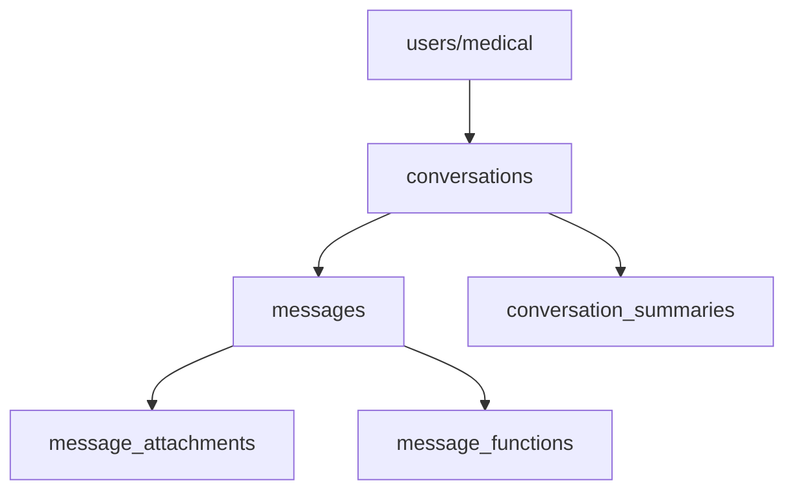

# AI Chat Tables Implementation Guide

## Overview

This document provides a comprehensive guide to the AI chat tables implementation for the Proxima health platform. The system is designed to store, manage, and query AI conversations efficiently while maintaining security and performance.

## Table of Contents

1. [Architecture Overview](#architecture-overview)
2. [Table Schemas](#table-schemas)
3. [Usage Patterns](#usage-patterns)
4. [Implementation Examples](#implementation-examples)
5. [Security & Privacy](#security--privacy)
6. [Performance Optimization](#performance-optimization)
7. [MCP Integration Strategy](#mcp-integration-strategy)
8. [API Integration](#api-integration)
9. [Best Practices](#best-practices)
10. [Troubleshooting](#troubleshooting)

---

## Architecture Overview

### Design Philosophy

The chat system follows a **multi-table relational approach** designed for:
- **Scalability**: Handle thousands of conversations per user
- **Performance**: Efficient querying and real-time updates
- **Security**: Row-level security and data isolation
- **Flexibility**: Support multiple AI providers and message types
- **Analytics**: Enable conversation insights and user behavior analysis

### Table Relationships



### Data Flow

1. **User starts conversation** → Create `conversations` record
2. **User sends message** → Insert into `messages` table
3. **AI responds** → Insert AI response into `messages` table
4. **Attachments uploaded** → Store in `message_attachments` table
5. **Conversation continues** → Additional messages linked to conversation
6. **Auto-updates** → Triggers update conversation metadata

---

## Table Schemas

### 1. Conversations Table

Primary table for managing chat sessions.

```sql
conversations (
  id UUID PRIMARY KEY,
  user_id UUID NOT NULL,           -- Links to user account
  title TEXT DEFAULT 'New Conversation',
  ai_provider TEXT DEFAULT 'openai', -- openai, claude, google, xai
  model_name TEXT DEFAULT 'gpt-4',   -- Specific model used
  conversation_type TEXT DEFAULT 'general_chat', -- health_analysis, symptom_check, etc.
  status TEXT DEFAULT 'active',      -- active, archived, deleted
  created_at TIMESTAMP WITH TIME ZONE,
  updated_at TIMESTAMP WITH TIME ZONE,
  last_message_at TIMESTAMP WITH TIME ZONE,
  message_count INTEGER DEFAULT 0,
  total_tokens INTEGER DEFAULT 0,
  metadata JSONB DEFAULT '{}'
)
```

**Key Features:**
- **Auto-generated titles**: Can be updated by AI or user
- **Provider tracking**: Support for multiple AI services
- **Conversation types**: Categorize chats for better organization
- **Token tracking**: Monitor usage for billing/limits
- **Flexible metadata**: Store provider-specific configuration

### 2. Messages Table

Stores individual messages within conversations.

```sql
messages (
  id UUID PRIMARY KEY,
  conversation_id UUID REFERENCES conversations(id),
  role TEXT CHECK (role IN ('user', 'assistant', 'system')),
  content TEXT NOT NULL,
  content_type TEXT DEFAULT 'text', -- text, image, file, json
  token_count INTEGER DEFAULT 0,
  model_used TEXT,                  -- Specific model for this message
  processing_time INTEGER DEFAULT 0, -- Response time in ms
  attachments JSONB DEFAULT '[]',
  metadata JSONB DEFAULT '{}',
  created_at TIMESTAMP WITH TIME ZONE,
  updated_at TIMESTAMP WITH TIME ZONE
)
```

**Key Features:**
- **OpenAI-compatible roles**: Standard message format
- **Multiple content types**: Support for rich media
- **Performance tracking**: Monitor AI response times
- **Extensible metadata**: Store model-specific data

### 3. Message Attachments Table

Handles file uploads and media attachments.

```sql
message_attachments (
  id UUID PRIMARY KEY,
  message_id UUID REFERENCES messages(id),
  file_name TEXT NOT NULL,
  file_type TEXT NOT NULL,
  file_size INTEGER NOT NULL,
  storage_path TEXT NOT NULL,
  upload_date TIMESTAMP WITH TIME ZONE,
  metadata JSONB DEFAULT '{}'
)
```

**Key Features:**
- **File management**: Track uploaded files
- **Storage integration**: Links to file storage system
- **Metadata support**: Store file processing results

---

## Usage Patterns

### 1. Starting a New Conversation

```javascript
// Create new conversation
const { data: conversation } = await supabase
  .from('conversations')
  .insert({
    user_id: user.id,
    title: 'Health Consultation',
    ai_provider: 'openai',
    model_name: 'gpt-4',
    conversation_type: 'health_analysis'
  })
  .select()
  .single();

// Add initial user message
await supabase.from('messages').insert({
  conversation_id: conversation.id,
  role: 'user',
  content: 'I have been experiencing chest pain. Can you help me understand what might be causing this?',
  content_type: 'text',
  token_count: 20
});
```

### 2. Continuing a Conversation

```javascript
// Add user message
await supabase.from('messages').insert({
  conversation_id: conversationId,
  role: 'user',
  content: userMessage,
  content_type: 'text',
  token_count: countTokens(userMessage)
});

// Add AI response
await supabase.from('messages').insert({
  conversation_id: conversationId,
  role: 'assistant',
  content: aiResponse,
  content_type: 'text',
  token_count: countTokens(aiResponse),
  model_used: 'gpt-4-turbo',
  processing_time: responseTime,
  metadata: {
    temperature: 0.7,
    max_tokens: 1000,
    finish_reason: 'stop'
  }
});
```

### 3. Loading Conversation History

```javascript
// Get conversation list
const { data: conversations } = await supabase
  .from('conversations')
  .select('id, title, ai_provider, last_message_at, message_count')
  .eq('user_id', user.id)
  .eq('status', 'active')
  .order('last_message_at', { ascending: false })
  .limit(50);

// Get messages for specific conversation
const { data: messages } = await supabase
  .from('messages')
  .select('*')
  .eq('conversation_id', conversationId)
  .order('created_at', { ascending: true });
```

### 4. Searching Conversations

```javascript
// Full-text search across all user's messages
const { data: searchResults } = await supabase
  .from('messages')
  .select(`
    id, content, created_at,
    conversations (title, ai_provider, conversation_type)
  `)
  .textSearch('content', 'anxiety OR stress OR chest pain')
  .eq('conversations.user_id', user.id)
  .order('created_at', { ascending: false });
```

---

## Implementation Examples

### React Hook for Chat Management

```typescript
// hooks/useChat.ts
import { useState, useEffect } from 'react';
import { supabase } from '@/lib/supabase';

interface ChatMessage {
  id: string;
  role: 'user' | 'assistant' | 'system';
  content: string;
  created_at: string;
  token_count: number;
  processing_time?: number;
}

interface Conversation {
  id: string;
  title: string;
  ai_provider: string;
  model_name: string;
  conversation_type: string;
  created_at: string;
  updated_at: string;
  message_count: number;
}

export const useChat = (conversationId?: string) => {
  const [conversations, setConversations] = useState<Conversation[]>([]);
  const [messages, setMessages] = useState<ChatMessage[]>([]);
  const [loading, setLoading] = useState(false);
  const [error, setError] = useState<string | null>(null);

  // Load conversations
  const loadConversations = async () => {
    try {
      setLoading(true);
      const { data, error } = await supabase
        .from('conversations')
        .select('*')
        .eq('status', 'active')
        .order('last_message_at', { ascending: false });

      if (error) throw error;
      setConversations(data || []);
    } catch (err) {
      setError(err instanceof Error ? err.message : 'Unknown error');
    } finally {
      setLoading(false);
    }
  };

  // Load messages for conversation
  const loadMessages = async (convId: string) => {
    try {
      setLoading(true);
      const { data, error } = await supabase
        .from('messages')
        .select('*')
        .eq('conversation_id', convId)
        .order('created_at', { ascending: true });

      if (error) throw error;
      setMessages(data || []);
    } catch (err) {
      setError(err instanceof Error ? err.message : 'Unknown error');
    } finally {
      setLoading(false);
    }
  };

  // Create new conversation
  const createConversation = async (
    title: string,
    aiProvider: string = 'openai',
    conversationType: string = 'general_chat'
  ) => {
    try {
      const { data: user } = await supabase.auth.getUser();
      if (!user.user) throw new Error('Not authenticated');

      const { data, error } = await supabase
        .from('conversations')
        .insert({
          user_id: user.user.id,
          title,
          ai_provider: aiProvider,
          model_name: aiProvider === 'openai' ? 'gpt-4' : 'claude-3',
          conversation_type: conversationType
        })
        .select()
        .single();

      if (error) throw error;
      await loadConversations();
      return data;
    } catch (err) {
      setError(err instanceof Error ? err.message : 'Unknown error');
      throw err;
    }
  };

  // Send message
  const sendMessage = async (
    conversationId: string,
    content: string,
    role: 'user' | 'assistant' = 'user'
  ) => {
    try {
      const { data, error } = await supabase
        .from('messages')
        .insert({
          conversation_id: conversationId,
          role,
          content,
          content_type: 'text',
          token_count: estimateTokens(content)
        })
        .select()
        .single();

      if (error) throw error;
      
      // Refresh messages
      await loadMessages(conversationId);
      return data;
    } catch (err) {
      setError(err instanceof Error ? err.message : 'Unknown error');
      throw err;
    }
  };

  // Delete conversation
  const deleteConversation = async (conversationId: string) => {
    try {
      const { error } = await supabase
        .from('conversations')
        .update({ status: 'deleted' })
        .eq('id', conversationId);

      if (error) throw error;
      await loadConversations();
    } catch (err) {
      setError(err instanceof Error ? err.message : 'Unknown error');
      throw err;
    }
  };

  // Archive conversation
  const archiveConversation = async (conversationId: string) => {
    try {
      const { error } = await supabase
        .from('conversations')
        .update({ status: 'archived' })
        .eq('id', conversationId);

      if (error) throw error;
      await loadConversations();
    } catch (err) {
      setError(err instanceof Error ? err.message : 'Unknown error');
      throw err;
    }
  };

  // Initialize
  useEffect(() => {
    loadConversations();
  }, []);

  useEffect(() => {
    if (conversationId) {
      loadMessages(conversationId);
    }
  }, [conversationId]);

  return {
    conversations,
    messages,
    loading,
    error,
    createConversation,
    sendMessage,
    deleteConversation,
    archiveConversation,
    loadConversations,
    loadMessages
  };
};

// Utility function to estimate tokens
function estimateTokens(text: string): number {
  // Rough estimation: 1 token ≈ 4 characters
  return Math.ceil(text.length / 4);
}
```

### Chat Component Implementation

```typescript
// components/AIChat.tsx
import { useState, useRef, useEffect } from 'react';
import { useChat } from '@/hooks/useChat';
import { Send, Plus, Archive, Trash2 } from 'lucide-react';

interface AIChatProps {
  conversationId?: string;
  onConversationChange?: (id: string) => void;
}

export const AIChat = ({ conversationId, onConversationChange }: AIChatProps) => {
  const [inputMessage, setInputMessage] = useState('');
  const [isLoading, setIsLoading] = useState(false);
  const messagesEndRef = useRef<HTMLDivElement>(null);
  
  const {
    conversations,
    messages,
    loading,
    error,
    createConversation,
    sendMessage,
    deleteConversation,
    archiveConversation
  } = useChat(conversationId);

  // Auto-scroll to bottom
  useEffect(() => {
    messagesEndRef.current?.scrollIntoView({ behavior: 'smooth' });
  }, [messages]);

  const handleSendMessage = async () => {
    if (!inputMessage.trim() || !conversationId) return;

    try {
      setIsLoading(true);
      
      // Send user message
      await sendMessage(conversationId, inputMessage, 'user');
      
      // Clear input
      setInputMessage('');
      
      // TODO: Call AI API and send response
      // This would integrate with your AI provider
      await callAIAndRespond(conversationId, inputMessage);
      
    } catch (err) {
      console.error('Error sending message:', err);
    } finally {
      setIsLoading(false);
    }
  };

  const callAIAndRespond = async (convId: string, userMessage: string) => {
    try {
      // Get conversation context
      const context = messages.slice(-10); // Last 10 messages for context
      
      // Call AI API (OpenAI example)
      const response = await fetch('/api/ai/chat', {
        method: 'POST',
        headers: { 'Content-Type': 'application/json' },
        body: JSON.stringify({
          conversationId: convId,
          messages: context,
          newMessage: userMessage
        })
      });

      const aiResponse = await response.json();
      
      // Save AI response
      await sendMessage(convId, aiResponse.content, 'assistant');
      
    } catch (err) {
      console.error('Error calling AI:', err);
    }
  };

  const handleNewConversation = async () => {
    try {
      const newConv = await createConversation('New Health Chat', 'openai', 'health_analysis');
      onConversationChange?.(newConv.id);
    } catch (err) {
      console.error('Error creating conversation:', err);
    }
  };

  return (
    <div className="flex h-full bg-gray-900 text-white">
      {/* Sidebar - Conversation List */}
      <div className="w-1/3 border-r border-gray-700 p-4">
        <div className="flex items-center justify-between mb-4">
          <h2 className="text-xl font-semibold">Conversations</h2>
          <button
            onClick={handleNewConversation}
            className="p-2 bg-blue-600 hover:bg-blue-700 rounded-lg"
          >
            <Plus className="w-4 h-4" />
          </button>
        </div>
        
        <div className="space-y-2">
          {conversations.map((conv) => (
            <div
              key={conv.id}
              className={`p-3 rounded-lg cursor-pointer transition-colors ${
                conv.id === conversationId
                  ? 'bg-blue-600'
                  : 'bg-gray-800 hover:bg-gray-700'
              }`}
              onClick={() => onConversationChange?.(conv.id)}
            >
              <div className="flex items-center justify-between">
                <div>
                  <p className="font-medium truncate">{conv.title}</p>
                  <p className="text-sm text-gray-400">
                    {conv.message_count} messages • {conv.ai_provider}
                  </p>
                </div>
                <div className="flex space-x-1">
                  <button
                    onClick={(e) => {
                      e.stopPropagation();
                      archiveConversation(conv.id);
                    }}
                    className="p-1 hover:bg-gray-600 rounded"
                  >
                    <Archive className="w-3 h-3" />
                  </button>
                  <button
                    onClick={(e) => {
                      e.stopPropagation();
                      deleteConversation(conv.id);
                    }}
                    className="p-1 hover:bg-red-600 rounded"
                  >
                    <Trash2 className="w-3 h-3" />
                  </button>
                </div>
              </div>
            </div>
          ))}
        </div>
      </div>

      {/* Chat Area */}
      <div className="flex-1 flex flex-col">
        {/* Messages */}
        <div className="flex-1 overflow-y-auto p-4 space-y-4">
          {messages.map((message) => (
            <div
              key={message.id}
              className={`flex ${
                message.role === 'user' ? 'justify-end' : 'justify-start'
              }`}
            >
              <div
                className={`max-w-xs lg:max-w-md px-4 py-2 rounded-lg ${
                  message.role === 'user'
                    ? 'bg-blue-600 text-white'
                    : 'bg-gray-700 text-gray-100'
                }`}
              >
                <p className="text-sm">{message.content}</p>
                <p className="text-xs text-gray-400 mt-1">
                  {new Date(message.created_at).toLocaleTimeString()}
                  {message.processing_time && (
                    <span className="ml-2">({message.processing_time}ms)</span>
                  )}
                </p>
              </div>
            </div>
          ))}
          <div ref={messagesEndRef} />
        </div>

        {/* Input Area */}
        <div className="border-t border-gray-700 p-4">
          <div className="flex space-x-2">
            <input
              type="text"
              value={inputMessage}
              onChange={(e) => setInputMessage(e.target.value)}
              onKeyPress={(e) => e.key === 'Enter' && handleSendMessage()}
              placeholder="Type your message..."
              className="flex-1 bg-gray-800 border border-gray-600 rounded-lg px-4 py-2 focus:outline-none focus:border-blue-500"
              disabled={isLoading || !conversationId}
            />
            <button
              onClick={handleSendMessage}
              disabled={isLoading || !conversationId || !inputMessage.trim()}
              className="bg-blue-600 hover:bg-blue-700 disabled:bg-gray-600 px-4 py-2 rounded-lg transition-colors"
            >
              <Send className="w-4 h-4" />
            </button>
          </div>
        </div>
      </div>
    </div>
  );
};
```

---

## Security & Privacy

### Row Level Security (RLS)

The system implements comprehensive RLS policies:

```sql
-- Users can only access their own conversations
CREATE POLICY "Users can view their own conversations"
  ON conversations FOR SELECT
  USING (auth.uid()::text = user_id::text);

-- Users can only view messages in their conversations
CREATE POLICY "Users can view messages in their conversations"
  ON messages FOR SELECT
  USING (
    EXISTS (
      SELECT 1 FROM conversations 
      WHERE conversations.id = messages.conversation_id 
      AND conversations.user_id::text = auth.uid()::text
    )
  );
```

### Data Protection

- **Encryption at rest**: Supabase provides automatic encryption
- **Encryption in transit**: All communications over HTTPS
- **Data isolation**: RLS ensures complete user data separation
- **Audit trail**: All operations are logged with timestamps

### Privacy Considerations

- **Message content**: Consider additional encryption for sensitive health data
- **Token tracking**: Monitor for potential billing abuse
- **Data retention**: Implement automatic cleanup policies
- **Export capability**: Allow users to export their data

---

## Performance Optimization

### Indexing Strategy

```sql
-- Essential indexes for performance
CREATE INDEX idx_conversations_user_updated ON conversations(user_id, updated_at DESC);
CREATE INDEX idx_messages_conversation_created ON messages(conversation_id, created_at);
CREATE INDEX idx_messages_content_search ON messages USING GIN(to_tsvector('english', content));
```

### Query Optimization

```javascript
// Efficient conversation loading with pagination
const loadConversations = async (page = 0, limit = 20) => {
  const { data, error } = await supabase
    .from('conversations')
    .select('id, title, ai_provider, last_message_at, message_count')
    .eq('status', 'active')
    .order('last_message_at', { ascending: false })
    .range(page * limit, (page + 1) * limit - 1);
    
  return { data, error };
};

// Efficient message loading with context limit
const loadMessages = async (conversationId: string, limit = 50) => {
  const { data, error } = await supabase
    .from('messages')
    .select('id, role, content, created_at, token_count')
    .eq('conversation_id', conversationId)
    .order('created_at', { ascending: false })
    .limit(limit);
    
  return { data: data?.reverse(), error };
};
```

### Caching Strategy

```javascript
// React Query integration for caching
import { useQuery, useMutation, useQueryClient } from '@tanstack/react-query';

const useConversations = () => {
  return useQuery({
    queryKey: ['conversations'],
    queryFn: loadConversations,
    staleTime: 5 * 60 * 1000, // 5 minutes
    cacheTime: 10 * 60 * 1000, // 10 minutes
  });
};

const useMessages = (conversationId: string) => {
  return useQuery({
    queryKey: ['messages', conversationId],
    queryFn: () => loadMessages(conversationId),
    enabled: !!conversationId,
    staleTime: 1 * 60 * 1000, // 1 minute
  });
};
```

---

## MCP Integration Strategy

### Message Control Protocol (MCP) Implementation

The table structure is designed to support MCP integration for advanced AI capabilities:

#### 1. Function Calling Support

```sql
-- Add function calling metadata to messages
ALTER TABLE messages ADD COLUMN function_calls JSONB DEFAULT '[]';
ALTER TABLE messages ADD COLUMN function_results JSONB DEFAULT '[]';

-- Example function call storage
INSERT INTO messages (conversation_id, role, content, function_calls, function_results) 
VALUES (
  'conv-id',
  'assistant',
  'I need to check your health data first.',
  '[{"name": "get_health_data", "parameters": {"user_id": "123", "date_range": "7d"}}]',
  '[{"function": "get_health_data", "result": {"anxiety_avg": 6.2, "sleep_avg": 7.1}}]'
);
```

#### 2. Tool Integration

```typescript
// MCP Tool Registration
interface MCPTool {
  name: string;
  description: string;
  parameters: any;
  handler: (params: any) => Promise<any>;
}

const healthTools: MCPTool[] = [
  {
    name: 'get_health_metrics',
    description: 'Retrieve user health metrics for analysis',
    parameters: {
      type: 'object',
      properties: {
        user_id: { type: 'string' },
        metrics: { type: 'array', items: { type: 'string' } },
        date_range: { type: 'string' }
      }
    },
    handler: async (params) => {
      // Query health_tracking table
      const { data } = await supabase
        .from('health_tracking')
        .select('*')
        .eq('user_id', params.user_id)
        .gte('recorded_at', new Date(Date.now() - 7 * 24 * 60 * 60 * 1000));
      
      return data;
    }
  },
  {
    name: 'analyze_symptoms',
    description: 'Analyze user symptoms and provide insights',
    parameters: {
      type: 'object',
      properties: {
        symptoms: { type: 'array', items: { type: 'string' } },
        user_profile: { type: 'object' }
      }
    },
    handler: async (params) => {
      // Implement symptom analysis logic
      return { analysis: 'Based on your symptoms...', recommendations: [] };
    }
  }
];
```

#### 3. Context Management

```typescript
// MCP Context Manager
class MCPContextManager {
  private conversations: Map<string, any[]> = new Map();
  
  async getContext(conversationId: string, maxMessages: number = 10) {
    // Get recent messages from database
    const { data: messages } = await supabase
      .from('messages')
      .select('role, content, function_calls, function_results, created_at')
      .eq('conversation_id', conversationId)
      .order('created_at', { ascending: false })
      .limit(maxMessages);
    
    // Get user health context
    const { data: userProfile } = await supabase
      .from('medical')
      .select('*')
      .eq('id', userId)
      .single();
    
    return {
      messages: messages?.reverse() || [],
      userProfile,
      systemPrompt: this.generateHealthSystemPrompt(userProfile)
    };
  }
  
  private generateHealthSystemPrompt(userProfile: any): string {
    return `
      You are a health AI assistant. User profile:
      - Age: ${userProfile.age}
      - Medications: ${userProfile.medications?.map(m => m.name).join(', ')}
      - Allergies: ${userProfile.allergies?.join(', ')}
      - Health conditions: ${userProfile.personal_health_context}
      
      Always prioritize user safety and recommend consulting healthcare professionals for serious concerns.
    `;
  }
}
```

#### 4. Streaming Support

```typescript
// MCP Streaming Implementation
class MCPStreamingChat {
  async streamResponse(conversationId: string, userMessage: string) {
    // Save user message
    await supabase.from('messages').insert({
      conversation_id: conversationId,
      role: 'user',
      content: userMessage,
      content_type: 'text'
    });
    
    // Create placeholder for AI response
    const { data: aiMessage } = await supabase
      .from('messages')
      .insert({
        conversation_id: conversationId,
        role: 'assistant',
        content: '',
        content_type: 'text',
        metadata: { streaming: true }
      })
      .select()
      .single();
    
    // Stream AI response
    const stream = await this.callAIAPI(conversationId, userMessage);
    let fullResponse = '';
    
    for await (const chunk of stream) {
      fullResponse += chunk;
      
      // Update message in real-time
      await supabase
        .from('messages')
        .update({ content: fullResponse })
        .eq('id', aiMessage.id);
      
      // Emit to WebSocket clients
      this.emitToClients(conversationId, {
        type: 'message_chunk',
        messageId: aiMessage.id,
        content: fullResponse,
        isComplete: false
      });
    }
    
    // Mark as complete
    await supabase
      .from('messages')
      .update({ 
        content: fullResponse,
        metadata: { streaming: false, complete: true }
      })
      .eq('id', aiMessage.id);
  }
}
```

---

## API Integration

### REST API Endpoints

```typescript
// api/chat/conversations.ts
export async function GET(request: Request) {
  const { searchParams } = new URL(request.url);
  const page = parseInt(searchParams.get('page') || '0');
  const limit = parseInt(searchParams.get('limit') || '20');
  
  const { data, error } = await supabase
    .from('conversations')
    .select('*')
    .eq('status', 'active')
    .order('last_message_at', { ascending: false })
    .range(page * limit, (page + 1) * limit - 1);
    
  return Response.json({ data, error });
}

export async function POST(request: Request) {
  const body = await request.json();
  
  const { data, error } = await supabase
    .from('conversations')
    .insert({
      user_id: body.user_id,
      title: body.title,
      ai_provider: body.ai_provider,
      conversation_type: body.conversation_type
    })
    .select()
    .single();
    
  return Response.json({ data, error });
}

// api/chat/messages.ts
export async function GET(request: Request) {
  const { searchParams } = new URL(request.url);
  const conversationId = searchParams.get('conversation_id');
  
  const { data, error } = await supabase
    .from('messages')
    .select('*')
    .eq('conversation_id', conversationId)
    .order('created_at', { ascending: true });
    
  return Response.json({ data, error });
}

export async function POST(request: Request) {
  const body = await request.json();
  
  const { data, error } = await supabase
    .from('messages')
    .insert({
      conversation_id: body.conversation_id,
      role: body.role,
      content: body.content,
      content_type: body.content_type,
      token_count: body.token_count
    })
    .select()
    .single();
    
  return Response.json({ data, error });
}
```

### WebSocket Integration

```typescript
// WebSocket handler for real-time chat
class ChatWebSocketHandler {
  private clients: Map<string, WebSocket> = new Map();
  
  handleConnection(ws: WebSocket, userId: string) {
    this.clients.set(userId, ws);
    
    ws.on('message', async (data) => {
      const message = JSON.parse(data.toString());
      
      switch (message.type) {
        case 'send_message':
          await this.handleSendMessage(userId, message.data);
          break;
        case 'join_conversation':
          await this.handleJoinConversation(userId, message.conversationId);
          break;
      }
    });
    
    ws.on('close', () => {
      this.clients.delete(userId);
    });
  }
  
  private async handleSendMessage(userId: string, messageData: any) {
    // Save message to database
    const { data } = await supabase
      .from('messages')
      .insert(messageData)
      .select()
      .single();
    
    // Broadcast to conversation participants
    this.broadcastToConversation(messageData.conversation_id, {
      type: 'new_message',
      message: data
    });
  }
  
  private broadcastToConversation(conversationId: string, data: any) {
    // Get all participants (for now just the user)
    this.clients.forEach((ws, userId) => {
      if (ws.readyState === WebSocket.OPEN) {
        ws.send(JSON.stringify(data));
      }
    });
  }
}
```

---

## Best Practices

### 1. Data Management

- **Regular cleanup**: Archive old conversations periodically
- **Token monitoring**: Track and alert on excessive usage
- **Error handling**: Graceful degradation for API failures
- **Backup strategy**: Regular database backups

### 2. Performance

- **Pagination**: Always paginate large result sets
- **Indexing**: Monitor query performance and add indexes as needed
- **Caching**: Cache frequently accessed data
- **Connection pooling**: Manage database connections efficiently

### 3. Security

- **Input validation**: Sanitize all user inputs
- **Rate limiting**: Prevent abuse of chat endpoints
- **Audit logging**: Track all data access and modifications
- **Data encryption**: Encrypt sensitive health information

### 4. User Experience

- **Real-time updates**: Use WebSockets for instant messaging
- **Offline support**: Queue messages when offline
- **Search functionality**: Full-text search across conversations
- **Export options**: Allow users to export their chat history

---

## Troubleshooting

### Common Issues

#### 1. Messages Not Appearing
```sql
-- Check RLS policies
SELECT * FROM pg_policies WHERE tablename = 'messages';

-- Verify user permissions
SELECT auth.uid(), user_id FROM conversations WHERE id = 'conversation-id';
```

#### 2. Performance Issues
```sql
-- Check missing indexes
SELECT schemaname, tablename, attname, n_distinct, correlation
FROM pg_stats
WHERE tablename IN ('conversations', 'messages')
ORDER BY n_distinct DESC;

-- Monitor query performance
EXPLAIN ANALYZE SELECT * FROM messages WHERE conversation_id = 'id';
```

#### 3. Token Count Discrepancies
```javascript
// Implement consistent token counting
const countTokens = (text: string, model: string = 'gpt-4') => {
  // Use tiktoken library for accurate counting
  const encoding = tiktoken.encoding_for_model(model);
  return encoding.encode(text).length;
};
```

### Debugging Queries

```sql
-- Find conversations with high message counts
SELECT c.id, c.title, COUNT(m.id) as message_count
FROM conversations c
LEFT JOIN messages m ON c.id = m.conversation_id
GROUP BY c.id, c.title
HAVING COUNT(m.id) > 100
ORDER BY message_count DESC;

-- Find users with high token usage
SELECT c.user_id, SUM(c.total_tokens) as total_tokens
FROM conversations c
WHERE c.created_at >= NOW() - INTERVAL '30 days'
GROUP BY c.user_id
ORDER BY total_tokens DESC;

-- Check message processing times
SELECT AVG(processing_time) as avg_time, MAX(processing_time) as max_time
FROM messages
WHERE role = 'assistant'
  AND processing_time > 0
  AND created_at >= NOW() - INTERVAL '7 days';
```

---

## Future Enhancements

### 1. Advanced Analytics
- Conversation topic analysis
- User engagement metrics
- AI response quality scoring
- Health insights correlation

### 2. Integration Capabilities
- EHR system integration
- Wearable device data
- Voice chat support
- Multi-modal AI (text, image, voice)

### 3. Collaboration Features
- Shared conversations with healthcare providers
- Family member access controls
- Emergency contact notifications
- Care team coordination

### 4. AI Improvements
- Context-aware responses
- Personalized AI personalities
- Multilingual support
- Continuous learning from interactions

---

This documentation provides a comprehensive foundation for implementing and extending the AI chat system. The architecture is designed to be scalable, secure, and ready for future MCP integration while maintaining excellent performance and user experience. 